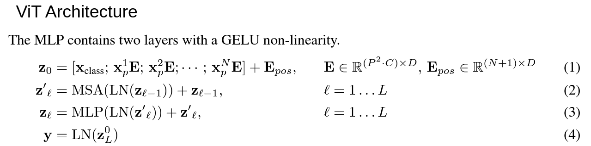

# Vision-Transformers

## The Classic ViT
* 
* To handle 2D images we reshape images of shape $(H, W, C)$ to a shape $(N, P^2*C)$, where $(P, P)$ is resolution of the original patch and $N=HW/P^2$ which is the resulting number of patches, which also serves as the effective input sequence length to the transformer
* The last dimention is projected to $d_{model} = D$
* 
* $x_p^i$ is of shape $(N, P^2*C)$ is linearly projected to shape $(N, D)$ using weights of shape $(P^2*C, D)$, and $i$ goes from $1$ to $N$
* Similar to BERT’s `[class]` token, we prepend a learnable embedding to the sequence of embedded patches ($z_0^0 = x_{class}$), whose state at the output of the Transformer encoder $(z^0_L)$ serves as the image representation $y$ (Eq. 4). Both during pre-training and fine-tuning, a classification head is attached to $z_L^0$
* $x_{class}$ is of shape $(1, D)$
* $z_0$ is of shape $(N+1, D)$
